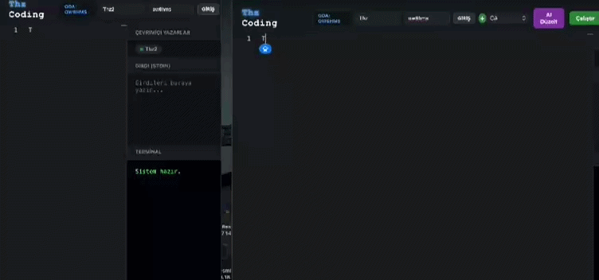

# GDB-RealtimeCoding-Editor
# 🚀 GDB - Real-Time Multi-Language Code Editor & AI Optimizer

[English](#english) | [Turkish](#turkish) | [Installation](#installation)

---

## English 

### 📝 Project Overview
**gdb.yourdomain.com** is a high-performance, real-time collaborative coding environment. It allows multiple users to write, discuss, and execute code simultaneously in a shared "Room" system. Built with a focus on education and rapid prototyping, it bridges the gap between solo coding and team collaboration.

### ✨ Key Features
* **Multi-Language Execution:** Supports 5 different programming languages (JS, Python, C#, etc.) directly in the browser.
* **Real-Time Collaboration:** Powered by **Socket.io**. Every character typed is synchronized instantly across all users in the same room.
* **AI Code Assistant:** Integrated AI module that can automatically detect errors, suggest fixes, and optimize code logic.
* **Dynamic Room System:** Users can create private or public rooms to work on specific tasks together.
* **High Performance:** Backend built on **Node.js** for low-latency data transmission.

### 🛠 Tech Stack
* **Runtime:** Node.js
* **Communication:** Socket.io (WebSockets)
* **Frontend:** HTML5, CSS3 (Apple-inspired UI), Vanilla JavaScript
* **Backend Compiler:** PHP (via cURL to JDoodle/Glot.io API)
* **AI Integration:** Custom API connection for code analysis.

### 🔒 Security Note
As a Cybersecurity student, security is a priority. This repository contains the logic of the project. Sensitive data such as **API Keys**, **Environment Variables**, and **Server Credentials** have been removed for security reasons.

---

## Turkish 

### 📝 Proje Hakkında
**GDB.batuthz.com**, yüksek performanslı ve gerçek zamanlı bir iş birliği odaklı kod editörüdür. Kullanıcıların aynı "Oda" sistemi içerisinde aynı anda kod yazmasına, tartışmasına ve çalıştırmasına olanak tanır. Eğitim ve hızlı prototipleme odaklı geliştirilen bu proje, bireysel çalışma ile takım çalışması arasındaki boşluğu doldurur.

### ✨ Temel Özellikler
* **Çoklu Dil Desteği:** 5 farklı programlama dilini (JS, Python, C# vb.) doğrudan tarayıcıda çalıştırabilme.
* **Gerçek Zamanlı Senkronizasyon:** **Socket.io** altyapısı ile yazılan her karakter, odadaki tüm kullanıcılara anlık olarak iletilir.
* **Yapay Zeka Asistanı:** Hataları otomatik tespit eden, düzeltmeler öneren ve kod mantığını optimize eden entegre YZ modülü.
* **Dinamik Oda Sistemi:** Kullanıcılar belirli görevler üzerinde beraber çalışmak için özel veya genel odalar açabilir.
* **Düşük Gecikme:** Kesintisiz veri akışı için **Node.js** tabanlı sunucu mimarisi.

### 🛠 Kullanılan Teknolojiler
* **Çalışma Ortamı:** Node.js
* **Haberleşme:** Socket.io (WebSockets)
* **Arayüz:** HTML5, CSS3 (Apple stili UI), Vanilla JavaScript
* **Derleyici Arka Planı:** PHP (cURL ile JDoodle/Glot.io API bağlantısı)
* **YZ Entegrasyonu:** Kod analizi için özel API bağlantısı.

### 🔒 Güvenlik Notu
Bir Siber Güvenlik öğrencisi olarak güvenlik önceliğimdir. Bu depo, projenin çalışma mantığını içerir. **API Anahtarları**, **Ortam Değişkenleri** ve **Sunucu Bilgileri** güvenlik nedeniyle kaldırılmıştır.

---

### 📸 Screenshots & Demo

*Gerçek zamanlı oda sistemi ve anlık kod senkronizasyonu.*

---

## 🛠 Kurulum / Installation 

### 🇹🇷 Türkçe Kurulum Rehberi (cPanel / Web Hosting)

Bu projeyi doğrudan web sitenizde (hosting üzerinde) çalıştırmak için aşağıdaki adımları izleyin:

1. **Dosyaları Yükleyin:**
   * Hosting panelinize (cPanel/Plesk vb.) giriş yapın ve `Dosya Yöneticisi`ni açın.
   * Projedeki tüm dosyaları (`index.html`, `server.js`, `derle.php`, `package.json`) ana dizine (genellikle `public_html`) yükleyin.

2. **Node.js Uygulamasını Başlatın:**
   * Hosting panelinizden **"Setup Node.js App"** (Node.js Uygulaması Kur/Yapılandır) menüsüne girin.
   * Yeni bir uygulama oluşturun. Başlangıç dosyası (Startup file) olarak `server.js` yazın.
   * Uygulamayı oluşturduktan sonra paneldeki **"NPM Install"** butonuna basarak gerekli kütüphaneleri (Express, Socket.io) otomatik olarak kurun.

3. **API Anahtarlarını Alın ve Ekleyin:**
   * **Yapay Zeka (Groq):** [Groq Console](https://console.groq.com/) üzerinden ücretsiz API anahtarı alın ve `server.js` içindeki `YOUR_GROQ_API_KEY_HERE` alanına ekleyin.
   * **Kod Derleyici (JDoodle/Glot):** Derleyici servislerinden (JDoodle veya Glot.io) API anahtarlarınızı alın ve `derle.php` (veya sunucu türünüze göre `server.js`) içindeki ilgili güvenli alanlara yerleştirin.

4. **Projeyi Başlatın:**
   * Node.js panelinden **"Start App"** (Uygulamayı Başlat) butonuna tıklayın. Siteniz artık canlıda!

---

### 🇺🇸 English Setup Guide (cPanel / Web Hosting)

Follow these steps to deploy the project directly to your web hosting environment:

1. **Upload Files:**
   * Log in to your hosting control panel (cPanel/Plesk, etc.) and open the `File Manager`.
   * Upload all project files (`index.html`, `server.js`, `derle.php`, `package.json`) to your root directory (usually `public_html`).

2. **Setup Node.js App:**
   * Navigate to the **"Setup Node.js App"** section in your hosting panel.
   * Create a new application and set the Startup file to `server.js`.
   * Once created, click the **"Run NPM Install"** button in the panel to automatically install the required libraries (Express, Socket.io).

3. **Get and Insert API Keys:**
   * **AI Assistant (Groq):** Get a free API key from the [Groq Console](https://console.groq.com/) and insert it into `server.js` (replace `YOUR_GROQ_API_KEY_HERE`).
   * **Code Compiler (JDoodle/Glot):** Get your API tokens for the compiler service and place them in the secure sections of `derle.php` (or `server.js` depending on your compiler route).

4. **Start the Project:**
   * Click the **"Start App"** button in your Node.js settings. Your site is now live!
